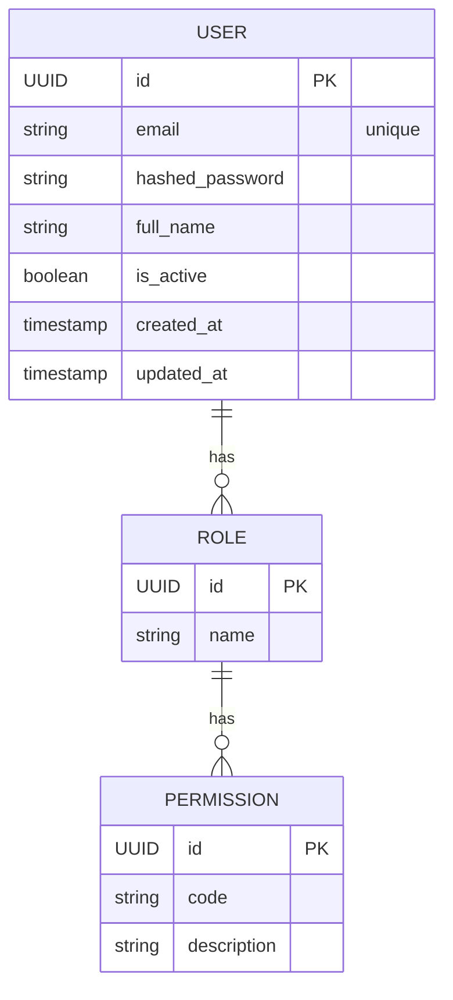

# 認証システム設計書 — **パターンA：100 % JWT（Stateless）版**

## 1. 概要
Next.js（フロントエンド）と FastAPI（バックエンド）間で**完全 stateless な JWT 認証**を採用。  
- **Access Token**：短命（15 分想定）  
- **Refresh Token**：長命（30 日想定）  
- バックエンドは署名検証のみでユーザー状態を保持しない  
- ログアウトやパスワード変更時は Refresh Token をブラックリストに登録して失効させる  

## 2. 認証フロー

### 2.1 サインアップ
1. ユーザーがサインアップフォーム入力（email, password, name）  
2. **POST `/api/v1/auth/signup`**  
3. バックエンド  
   - email 重複チェック  
   - bcrypt でハッシュ化  
   - 仮登録 → Email verification（トークン付きリンク送信）  
4. 本登録完了後、**Access / Refresh** を発行して JSON で返却  
5. Next‑Auth `jwt` コールバックで  
   - Access Token → **Authorization ヘッダ or Cookie(HttpOnly; SameSite=None)**  
   - Refresh Token → **HttpOnly Cookie** に保存  

### 2.2 ログイン
1. Credentials Provider で email / password 送信  
2. **POST `/api/v1/auth/login`**  
3. 認証成功時に Access / Refresh 発行 → 以降はサインアップと同様に保存  

### 2.3 トークンリフレッシュ
1. Access 失効時、フロントが自動で **POST `/api/v1/auth/refresh`**  
2. バックエンド  
   - Refresh Token 検証（ブラックリスト・期限）  
   - 新しい Access/Refresh 発行＋旧 Refresh を失効リストへ  

### 2.4 ログアウト
1. フロントの `/logout` で **POST `/api/v1/auth/logout`**  
2. バックエンドで受け取った Refresh Token をブラックリストに登録  
3. フロントの Access / Refresh Cookie を削除  

## 3. 技術スタック

| レイヤ | 採用技術 |
| ------ | -------- |
| **Next.js** | Next‑Auth v5 (Credentials Provider + JWT Strategy) |
| **FastAPI** | 自作エンドポイント + `pyjwt[crypto]` (RS256) |
| **パスワードハッシュ** | `passlib[bcrypt]` |
| **Refresh 失効リスト** | Redis (SET + TTL) または PostgreSQL |
| **レート制限** | `fastapi-limiter` (Redis) |
| **OpenTelemetry** | Trace 収集用（任意） |

## 4. データモデル



*権限は多対多テーブルで正規化。*

## 5. API エンドポイント

| Method | Path | 説明 |
| ------ | ---- | ---- |
| `POST` | `/api/v1/auth/signup` | 新規登録 |
| `POST` | `/api/v1/auth/login` | ログイン |
| `POST` | `/api/v1/auth/refresh` | トークン再発行 |
| `POST` | `/api/v1/auth/logout` | ログアウト（Refresh 失効） |
| `GET`  | `/api/v1/auth/me` | 現在ユーザー取得 |
| `POST` | `/api/v1/auth/change-password` | パスワード変更 |
| `DELETE` | `/api/v1/auth/delete-account` | 退会 |

## 6. アクセス制御

- **RBAC**：`admin / teacher / student`  
- FastAPI 依存性注入で `Depends(role_required("admin"))` のようにチェック  
- WebSocket では最初の接続 QueryParam に Access Token を付与、バックエンドで検証

## 7. トークン管理

| 種類 | 保管場所 | 期限 | 備考 |
| ---- | -------- | ---- | ---- |
| **Access** | Cookie or Memory（Authorization ヘッダ） | 15 分 | 署名のみ検証 |
| **Refresh** | HttpOnly Cookie | 30 日 | 失効リスト運用（jti 付与） |

> **CSRF 対策**：Access を Cookie に入れる場合は Double‑Submit Cookie + `SameSite=None; Secure`

## 8. セキュリティ対策

1. **RS256 署名**：公開鍵は Next.js と他マイクロサービスに配布  
2. **Email Verification**：登録時必須  
3. **レート制限**：`/login` `/signup` `/refresh` に IP + email 単位で設定  
4. **アカウントロック**：連続失敗 5 回 → 15 分ロック  
5. **2FA**：TOTP をロードマップに追加（Next‑Auth callback でフラグ確認）  

## 9. エラー仕様

```jsonc
{
  "error": {
    "code": "token_expired",      // or invalid_credentials, locked_out …
    "message": "アクセストークンの有効期限が切れています。"
  }
}
```

## 10. テスト戦略

| 種類 | 重点シナリオ |
| ---- | ------------ |
| **単体** | JWT 署名/検証、Refresh 失効判定、ハッシュ化 |
| **統合** | Sign‑up → Verify → Login → Refresh → Protected API |
| **E2E** | ブラウザ自動テスト：CSRF、Cookie 属性、ログアウト即時無効 |
| **負荷** | `/refresh` QPS、Redis 失効セット肥大化 |

## 11. 環境変数例

```bash
# 共通
JWT_ALGORITHM=RS256
JWT_PRIVATE_KEY_PATH=/run/secrets/jwt_private.pem
JWT_PUBLIC_KEY_PATH=/run/secrets/jwt_public.pem
ACCESS_TOKEN_EXPIRE_MINUTES=15
REFRESH_TOKEN_EXPIRE_DAYS=30

# FastAPI
DATABASE_URL=postgresql://...
REDIS_URL=redis://...

# Next.js
NEXTAUTH_URL=https://app.example.com
NEXT_PUBLIC_API_BASE_URL=https://api.example.com
```

## 12. 今後の拡張ロードマップ

1. **2FA (TOTP/ WebAuthn)**  
2. **OAuth / Social Login (Google, GitHub)**  
3. **監査ログ基盤**（SIEM 連携）  
4. **JWT クレーム最小化 & 暗号化 (JWE)**  

## 13. 決定事項まとめ

- **採用パターン**：完全 stateless JWT  
- **Access 15 min / Refresh 30 d、ブラックリスト方式で失効管理**  
- **SessionMiddleware は使用しない**  
- **Email Verification & レート制限は MVP から実装**
