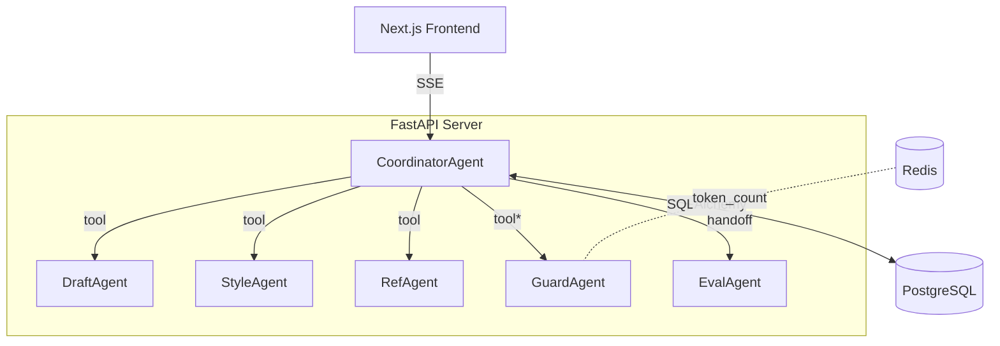
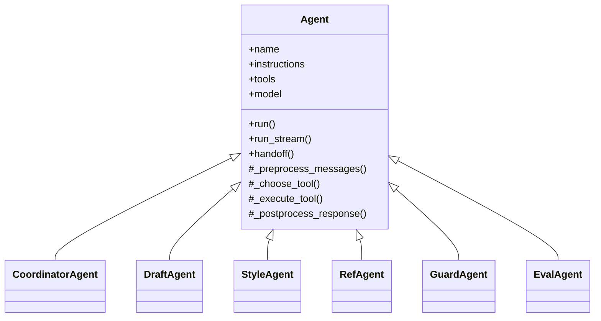
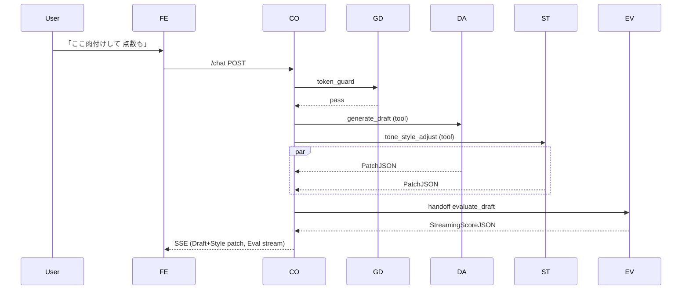

# \*\*SmartAO Coach マルチエージェント基盤

技術仕様書 v1.0（AgentSDK 0.9 準拠）\*\*

---

## 0. 目的と背景

本書は、"左 = Draft / 右 = Chat" で AO 志望理由書を双方向添削する **SmartAO Coach** の
バックエンドを、**OpenAI Agents SDK** 上でマルチエージェント化して実装するための
詳細仕様を定義する。開発者・レビュワー・運用担当が同一ドキュメントで
アーキテクチャ／クラス API／データモデル／非機能要件を共有することを目的とする。

---

## 1. 全体構成図



\* **GuardAgent** は *常駐ツール* として Coordinator 内で毎回先行実行。

---

## 2. 用語定義

| 用語                     | 定義                                                              |
| ---------------------- | --------------------------------------------------------------- |
| **Tool**               | Agents SDK が LLM に提供する関数呼び出しインターフェース。すべて pydantic で I/O スキーマ定義。 |
| **Handoff**            | Agent から別 Agent へコンテキストごと処理を委譲する仕組み。ストリーミングを維持。                 |
| **PatchJSON**          | `{new_text:str, change_map:list}` 形式のドラフト差分パッケージ。               |
| **StreamingScoreJSON** | EvalAgent が SSE で返す最終 JSON（採点表・講評を含む）。                          |

---

## 3. 機能要件

### 3.1 Draft リファイン

* 段落の肉付け、具体例追加、論理構造を保持したままリライト（Tool: `generate_draft`）。

### 3.2 スタイル変換

* 選択トーン（casual/polite 等）と敬体整合を保証。異文化不適切表現を検出（Tool: `tone_style_adjust`, `cultural_context_check`）。

### 3.3 ルーブリック評価

* 学部別 Rubric を用いた点数化と改善コメント生成。40 s 以内、JSON 完全性 100 % を担保（Handoff: EvalAgent → `evaluate_draft`）。

### 3.4 RAG 引用

* 学校ポリシー全文、論文 DOI 取得、ニュース要約を Draft に挿入（Tool 群: RefAgentの関連ツール）。

### 3.5 品質・コンプライアンス

* 誤字脱字検出・可読性数値化・盗作率算出。セッション総トークン 25 k 超過で自動ブロック（Tools: 10–13,19）。

### 3.6 リビジョン管理

* Draft 保存・版間 diff・一覧 API を提供。最終版を 90 日保持。

---

## 4. 非機能要件

| 区分           | 要件                                                   |
| ------------ | ---------------------------------------------------- |
| **遅延**       | 最初の SSE トークン < 3 s。Draft＋Style 並列時 95 パーセンタイル < 6 s。 |
| **可用性**      | API 月間稼働率 ≥ 99.8 %。                                  |
| **スケーラビリティ** | 100 同時セッション時もレイテンシ劣化 < 15 %。                         |
| **セキュリティ**   | RLS による行レベル保護、OpenAI Key はサーバ内環境変数、GDPR 準拠。          |
| **コスト監視**    | `token_usage` テーブルでモデル単価を固定算出、ダッシュボード公開。             |

---

## 5. クラス設計

### 5.1 抽象クラス図（UML）



### 5.2 CoordinatorAgent 仕様

| 項目             | 内容                                                               |
| -------------- | ---------------------------------------------------------------- |
| **モデル**        | `"o4-mini"` → fallback `"o3-mini"`                               |
| **public API** | `run_stream(messages, *, draft:str, session_id:UUID)`            |
| **主要オーバライド**   | `_preprocess_messages`, `_execute_tool`, `_postprocess_response` |
| **router()**   | ルールベース (初期) → LLM Router (Phase 2)                               |

### 5.3 DraftAgent 仕様

* **Primary Tool**: `generate_draft`, `introspective_prompt`, `interview_question_gen`
* **制約**: 見出し (`#`,`##`) 不改変。深掘りレベル 1–5。

### 5.4 StyleAgent 仕様

* 誤字・文化チェック→差分パッチを返す。`tone_style_adjust` は tone enum 厳格正規化。

### 5.5 RefAgent 仕様

* `vector_search` は Weaviate 先行、Fallback pgvector。最大 5 本引用。

### 5.6 GuardAgent 仕様

* `token_guard` 呼び出し回数 = **N ツール + handoff + 1**（原稿長チェック）。
* `plagiarism_check` が 0.4 以上 → Coordinator に `"block"` リスポンス。

### 5.7 EvalAgent 仕様

* ルーブリックスキーマは `rubrics(id, name, criteria jsonb)`。
* SSE チャンクフォーマット： `{delta}`… → 最終 `{score_table, advice_md, usage}`。

---

## 6. Tool 定義一覧（抜粋）

| Tool 名           | 入力モデル                 | 出力モデル                | 標準実行時間   |
| ---------------- | --------------------- | -------------------- | -------- |
| `generate_draft` | `GenerateDraftParams` | `PatchJSON`          | ≤ 12 s   |
| `evaluate_draft` | `EvaluateDraftParams` | `StreamingScoreJSON` | ≤ 40 s   |
| `token_guard`    | `TokenGuardParams`    | `TokenGuardResult`   | ≤ 100 ms |

（詳細スキーマは付録 A）

---

## 7. フロー定義

### 7.1 代表シナリオ：「肉付けして点数つけて」



---

## 8. データモデル

```sql
CREATE TABLE drafts(
  id UUID PRIMARY KEY,
  user_id UUID,
  title TEXT,
  latest_revision_id UUID,
  created_at timestamptz DEFAULT now()
);

CREATE TABLE revisions(
  id UUID PRIMARY KEY,
  draft_id UUID REFERENCES drafts,
  version VARCHAR,
  content TEXT,
  created_at timestamptz
);

CREATE TABLE agent_calls(
  id SERIAL PRIMARY KEY,
  session_id UUID,
  agent_name TEXT,
  model TEXT,
  prompt_tok INT,
  completion_tok INT,
  yen NUMERIC(12,4),
  duration_ms INT,
  created_at timestamptz DEFAULT now()
);

-- リフレクションおよび詳細なインタラクション分析用のログテーブル
CREATE TABLE agent_interaction_events (
  id UUID PRIMARY KEY DEFAULT uuid_generate_v4(),
  session_id UUID NOT NULL, -- セッションを一意に識別
  parent_interaction_id UUID REFERENCES agent_interaction_events(id), -- 親イベントがある場合 (例: tool_callに対するtool_response)
  agent_call_id UUID REFERENCES agent_calls(id), -- 関連するagent_callsテーブルのレコードID (LLM呼び出しを伴う場合)
  timestamp TIMESTAMPTZ DEFAULT now(),      -- イベント発生日時
  event_type VARCHAR(100) NOT NULL,         -- イベントの種類 (例: 'user_message', 'agent_message', 'tool_call', 'tool_response', 'evaluation_output', 'user_feedback')
  agent_name VARCHAR(100),                  -- イベント主体エージェント名 (Userも含む)
  tool_name VARCHAR(100),                   -- event_typeが'tool_call'や'tool_response'の場合のツール名
  content TEXT,                             -- イベントの主要な内容 (例: ユーザーの発言、エージェントの応答テキスト、ツールの出力テキスト)
  structured_content JSONB,                 -- 構造化されたイベント内容 (例: ツールの入力パラメータ、ツールの構造化された出力、評価スコアテーブル)
  metadata JSONB                            -- その他のメタデータ (例: メッセージロール、処理時間、エラー情報など)
);

CREATE INDEX idx_agent_interaction_events_session_id ON agent_interaction_events(session_id);
CREATE INDEX idx_agent_interaction_events_timestamp ON agent_interaction_events(timestamp);
CREATE INDEX idx_agent_interaction_events_event_type ON agent_interaction_events(event_type);
```

---

## 9. 例外処理方針

| クラス   | 発生例             | SDK 例外                   | Coordinator 対応  |
| ----- | --------------- | ------------------------ | --------------- |
| Tool  | ValidationError | `ToolValidationError`    | 「形式エラー」バブル      |
| LLM   | Timeout         | `LLMTimeoutError`        | fallback モデル再試行 |
| Guard | token≥limit     | — (`{"action":"block"}`) | 強制ブロック & 要約提案   |

---

## 10. デプロイ & CI

* **環境**: Docker Compose → staging on Fly.io → prod on AWS ECS Fargate + RDS。
* **CI**: GitHub Actions (`pytest -m unit`, `playwright test`, `black`)。
* **Telemetry**: OpenTelemetry → Datadog (traces, metrics `tokens_total`, `yen_total`)。
* **Secrets**: Doppler → container env。

---

## 11. ロードマップ

| フェーズ | 概要         | マイルストーン                                   |
| ---- | ---------- | ----------------------------------------- |
| 0    | Skeleton   | Draft + Style + Guard の tool 呼び出し         |
| 1    | Full Agent | Eval handoff, RefAgent, token\_guard 完全実装 |
| 2    | Router V2  | LLM Router、priority merge                 |
| 3    | Reflexion  | nightly apply\_reflexion + MetaAgent 自動改善 |

---

## 12. 付録 A – 主要 pydantic モデル（サンプル）

```python
class GenerateDraftParams(BaseModel):
    user_msg: str
    draft: str
    depth: conint(ge=1, le=5) = 2

class PatchJSON(BaseModel):
    new_text: str
    change_map: list[dict]

class TokenGuardParams(BaseModel):
    session_id: UUID
    model: str
    prompt_tok: int
    completion_tok: int

class TokenGuardResult(BaseModel):
    action: Literal["pass", "warn", "block"]
    reason: str | None = None
```

---

## 13. 付録 B – モデル単価表（pricing.py 抜粋）

| モデル                | Prompt JPY/k | Completion JPY/k |
| ------------------ | ------------ | ---------------- |
| o4-mini / 4.1-mini | 0.40         | 1.60             |
| o3-mini            | 0.13         | 0.52             |
| GPT-4o             | 5.00         | 20.00            |

---

## 14. 外部連携・API仕様

SmartAO Coach がその機能を実現するために依存する、または連携する主要な外部機能、API、ライブラリは以下の通りです。

| No. | 機能カテゴリ        | 具体的な技術・サービス名                     | 連携エージェント/ツール                                  | 主な目的・用途                                                                 | 備考（APIキー要否など）                               |
| --- | --------------- | -------------------------------------- | ------------------------------------------------------ | ---------------------------------------------------------------------- | ------------------------------------------------- |
| 1   | LLM             | OpenAI API (gpt-4o, gpt-3.5-turbo等)   | Coordinator, DraftAgent, StyleAgent, RefAgent, EvalAgent | 各種テキスト生成、リライト、評価、質問応答、埋め込みベクトル生成など、コアなAI機能全般                        | 要APIキー                                           |
| 2   | 参考文献検索      | OpenAlex REST API                      | RefAgent (`search_reference`)                          | 学術論文情報の検索、DOI取得                                                              | APIキー不要（Public API）                             |
| 3   | Web検索         | Bing Search API (S1)                   | RefAgent (`web_search`)                                | 最新情報や一般的なWebコンテンツの検索                                                          | 要APIキー、レート制限あり                               |
| 4   | 文法チェック        | LanguageTool-py                        | StyleAgent (`grammar_check`)                           | 自己ホスト型またはローカルでの文法・スペルチェック                                                    | サーバーモード未使用時はローカルライブラリとして動作                   |
| 5   | 可読性評価        | textstat (Pythonライブラリ)              | StyleAgent (`readability_score`)                       | フレッシュ指数、学年レベルなどの可読性指標算出                                                      | Pythonライブラリ依存                                  |
| 6   | キーワード抽出      | spaCy (ja_core_news_sm等)              | StyleAgent (`keyword_tag_extractor`)                   | 日本語形態素解析によるキーワード候補抽出（LLMによる再分類の前処理）                                       | Pythonライブラリ依存、日本語モデル要ダウンロード                  |
| 7   | 盗用チェック        | Turnitin API (または類似の外部サービス)      | GuardAgent (`plagiarism_check`)                        | 提出物のオリジナリティ検証、盗用検出                                                          | 要APIキー、サービス契約による。またはn-gramベースの簡易実装も検討。 |
| 8   | データベース        | PostgreSQL                             | Coordinator (DataService), RefAgent (`fetch_policy`), EvalAgent (`evaluate_draft`) | ユーザー情報、ドラフト、リビジョン、ポリシー、ルーブリック等の永続化。RLSによるユーザー別・学部別データアクセス制御。 | RLSによるユーザー別・学部別データアクセス制御             |
| 9   | キャッシュ/キュー   | Redis                                  | GuardAgent (`token_guard` - token_count想定)           | トークンカウントの一時保存、セッション管理、タスクキュー（将来的な拡張）、レートリミット管理など。                                  | Redisサーバーインスタンス要。                           |
| 10  | リフレクション/実験管理 | PostgreSQL (専用ログテーブル)        | EvalAgent (`apply_reflexion`), (Coordinator - ログ収集) | エージェントの振る舞い改善のためのリフレクションデータ収集・分析基盤。セッションごとの対話履歴、評価結果、中間生成物などを構造化してDBに記録し、日次バッチ等で分析・学習に活用。 | 専用のログスキーマ設計要。分析・可視化は別途ツール（例: BIツール、Pythonスクリプト）と連携。将来的にはLangSmith等の外部MLOpsプラットフォーム連携も検討可。 |
| 11  | 差分計算          | diff-match-patch (Pythonライブラリ)    | Coordinator (`diff_versions`)                          | テキスト間の差分を計算し、PatchJSON形式を生成                                                   | Pythonライブラリ依存。                                   |
| 12  | CI/CD           | GitHub Actions                         | (開発プロセス)                                           | コードのビルド、テスト（pytest, playwright）、フォーマット（black）、デプロイ自動化                  | GitHubリポジトリと連携設定要。                          |
| 13  | コンテナ管理        | Docker / Docker Compose                | (デプロイ環境)                                           | 開発・ステージング・本番環境のコンテナ化と管理                                                    | Docker DesktopまたはDocker Engineインストール要。           |
| 14  | ホスティング (Staging)| Fly.io                                 | (デプロイ環境)                                           | ステージング環境のホスティング                                                               | Fly.ioアカウント、flyctl CLI設定要。                     |
| 15  | ホスティング (Prod) | AWS ECS Fargate + RDS                  | (デプロイ環境)                                           | 本番環境のホスティング（コンテナオーケストレーションとマネージドデータベース）                               | AWSアカウント要                                      |
| 16  | テレメトリー        | OpenTelemetry / Datadog                | (運用監視)                                           | アプリケーショントレース、メトリクス（トークン総数、コスト総額など）の収集と可視化                            | Datadogアカウント要                                  |
| 17  | シークレット管理      | Doppler (または類似のシークレット管理ツール)   | (デプロイ・運用)                                       | APIキーやデータベース認証情報などの機密情報を安全に管理し、コンテナ環境変数として注入                         | Dopplerアカウントまたは代替ツールのセットアップ要。                |

### 以上

本仕様に対する質疑・フィードバックは GitHub "spec" イシューで受け付ける。
