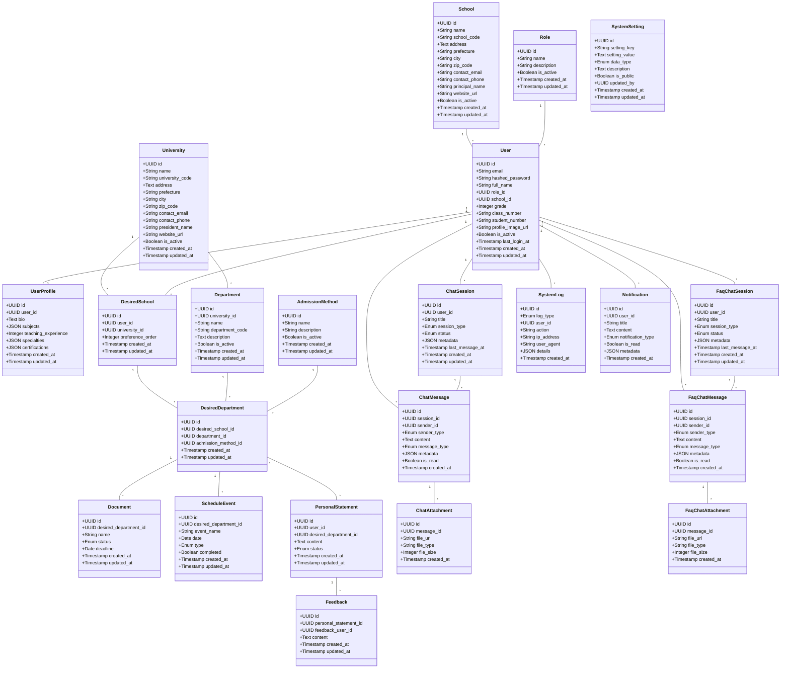

```mermaid
classDiagram

    %% User Management
    class User {
        +UUID id
        +String email
        +String hashed_password
        +String full_name
        +UUID role_id
        +UUID school_id
        +Integer grade
        +String class_number 
        +String student_number
        +String profile_image_url
        +Boolean is_active
        +Timestamp last_login_at
        +Timestamp created_at
        +Timestamp updated_at
    }

    class School {
        +UUID id
        +String name
        +String school_code
        +Text address
        +String prefecture
        +String city
        +String zip_code
        +String contact_email
        +String contact_phone
        +String principal_name
        +String website_url
        +Boolean is_active
        +Timestamp created_at
        +Timestamp updated_at
    }

    class UserProfile {
        +UUID id
        +UUID user_id
        +Text bio
        +JSON subjects
        +Integer teaching_experience
        +JSON specialties
        +JSON certifications
        +Timestamp created_at
        +Timestamp updated_at
    }

    class Role {
        +UUID id
        +String name
        +String description
        +Boolean is_active
        +Timestamp created_at
        +Timestamp updated_at
    }

    class University {
        +UUID id
        +String name
        +String university_code
        +Text address
        +String prefecture
        +String city
        +String zip_code
        +String contact_email
        +String contact_phone
        +String president_name
        +String website_url
        +Boolean is_active
        +Timestamp created_at
        +Timestamp updated_at
    }

    class Department {
        +UUID id
        +UUID university_id
        +String name
        +String department_code
        +Text description
        +Boolean is_active
        +Timestamp created_at
        +Timestamp updated_at
    }

    class AdmissionMethod {
        +UUID id
        +String name
        +String description
        +Boolean is_active
        +Timestamp created_at
        +Timestamp updated_at
    }

    class DesiredSchool {
        +UUID id
        +UUID user_id
        +UUID university_id
        +Integer preference_order
        +Timestamp created_at
        +Timestamp updated_at
    }

    class DesiredDepartment {
        +UUID id
        +UUID desired_school_id
        +UUID department_id
        +UUID admission_method_id
        +Timestamp created_at
        +Timestamp updated_at
    }

    class Document {
        +UUID id
        +UUID desired_department_id
        +String name
        +Enum status
        +Date deadline
        +Timestamp created_at
        +Timestamp updated_at
    }

    class ScheduleEvent {
        +UUID id
        +UUID desired_department_id
        +String event_name
        +Date date
        +Enum type
        +Boolean completed
        +Timestamp created_at
        +Timestamp updated_at
    }

    %% 新規追加
    class PersonalStatement {
        +UUID id
        +UUID user_id
        +UUID desired_department_id
        +Text content
        +Enum status
        +Timestamp created_at
        +Timestamp updated_at
    }

    class Feedback {
        +UUID id
        +UUID personal_statement_id
        +UUID feedback_user_id
        +Text content
        +Timestamp created_at
        +Timestamp updated_at
    }

    %% Chat System
    class ChatSession {
        +UUID id
        +UUID user_id
        +String title
        +Enum session_type
        +Enum status
        +JSON metadata
        +Timestamp last_message_at
        +Timestamp created_at
        +Timestamp updated_at
    }

    class ChatMessage {
        +UUID id
        +UUID session_id
        +UUID sender_id
        +Enum sender_type
        +Text content
        +Enum message_type
        +JSON metadata
        +Boolean is_read
        +Timestamp created_at
    }

    class ChatAttachment {
        +UUID id
        +UUID message_id
        +String file_url
        +String file_type
        +Integer file_size
        +Timestamp created_at
    }

    %% FAQChat System
    class FaqChatSession {
        +UUID id
        +UUID user_id
        +String title
        +Enum session_type
        +Enum status
        +JSON metadata
        +Timestamp last_message_at
        +Timestamp created_at
        +Timestamp updated_at
    }

    class FaqChatMessage {
        +UUID id
        +UUID session_id
        +UUID sender_id
        +Enum sender_type
        +Text content
        +Enum message_type
        +JSON metadata
        +Boolean is_read
        +Timestamp created_at
    }

    class FaqChatAttachment {
        +UUID id
        +UUID message_id
        +String file_url
        +String file_type
        +Integer file_size
        +Timestamp created_at
    }

    %% System Management
    class SystemLog {
        +UUID id
        +Enum log_type
        +UUID user_id
        +String action
        +String ip_address
        +String user_agent
        +JSON details
        +Timestamp created_at
    }

    class SystemSetting {
        +UUID id
        +String setting_key
        +Text setting_value
        +Enum data_type
        +Text description
        +Boolean is_public
        +UUID updated_by
        +Timestamp created_at
        +Timestamp updated_at
    }

    class Notification {
        +UUID id
        +UUID user_id
        +String title
        +Text content
        +Enum notification_type
        +Boolean is_read
        +JSON metadata
        +Timestamp created_at
    }

    %% Relationships
    User "1" -- "1" UserProfile
    User "1" -- "*" ChatSession
    User "1" -- "*" ChatMessage
    User "1" -- "*" FaqChatSession
    User "1" -- "*" FaqChatMessage
    User "1" -- "*" SystemLog
    User "1" -- "*" Notification
    School "1" -- "*" User
    University "1" -- "*" Department
    University "1" -- "*" DesiredSchool
    User "1" -- "*" DesiredSchool
    DesiredSchool "1" -- "*" DesiredDepartment
    Department "1" -- "*" DesiredDepartment
    AdmissionMethod "1" -- "*" DesiredDepartment
    DesiredDepartment "1" -- "*" Document
    DesiredDepartment "1" -- "*" ScheduleEvent
    DesiredDepartment "1" -- "*" PersonalStatement
    PersonalStatement "1" -- "*" Feedback
    ChatSession "1" -- "*" ChatMessage
    ChatMessage "1" -- "*" ChatAttachment
    FaqChatSession "1" -- "*" FaqChatMessage
    FaqChatMessage "1" -- "*" FaqChatAttachment
    Role "1" -- "*" User
```