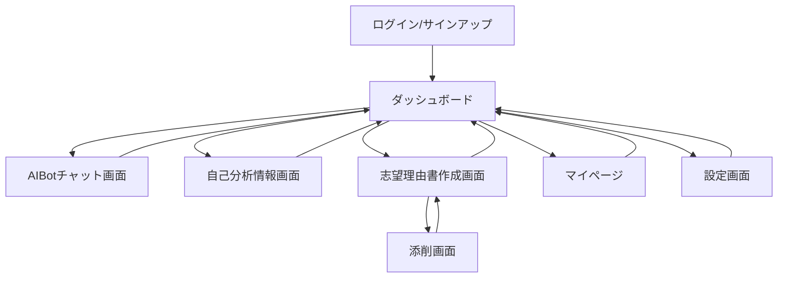

現在、総合選抜版のスタディサプリのようなWebアプリを開発しようと考えています。
あなたは、以下の機能構成をもとにフロントエンドを実装してください

## 機能
- AIBotとのチャットによって生徒のこれまでの経験やこれからしたいことを聞き出して生徒の自己理解を深める機能
- 上記で収集した生徒の自己理解情報をもとに志望理由書等を書くのを補助する機能
- 総合選抜入試を進める上で相談したいことを聞けるチャットボット
- 書いた志望理由書を添削できる機能
- 生徒のマイページ

## 構成
- トップページとマーケティングページはSSR/SSGで構成する
- ログイン後のマイページ等のアプリケーション部分はSPAで構成する
- UIフレームワークはReact+Next.js
- チャットにはWebSocketで通信を行う

## その他
- UIはモダンな感じにしたい。
- 生徒が直観的に使えるUIにしたい

## 画面構成図

