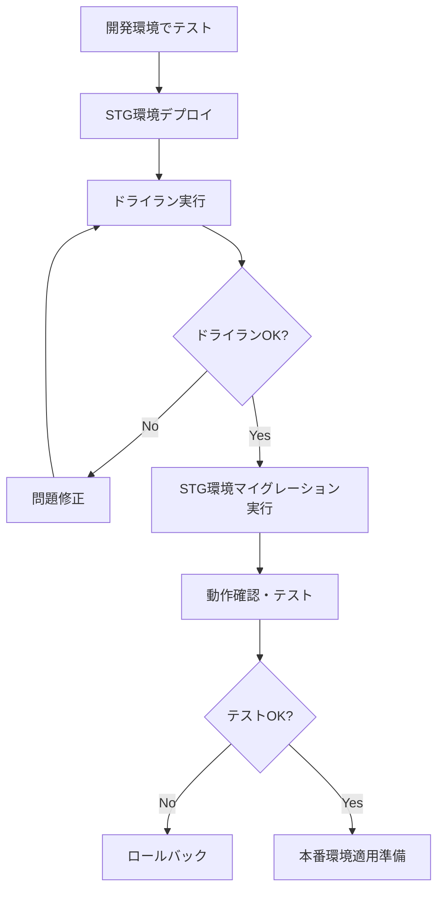
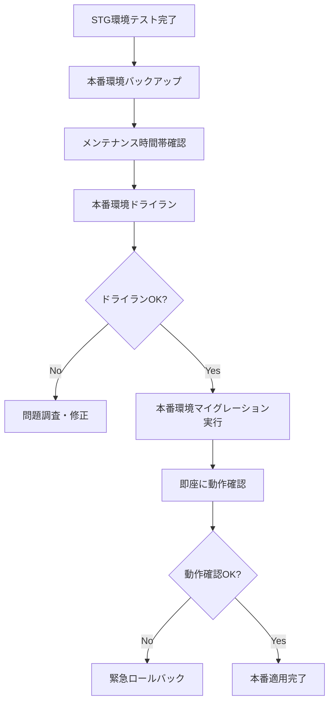

# インフラ統合ガイド - ECS Fargate環境

## 🎯 概要

学校テナント機能の権限・ロール管理をECS Fargate環境で実行するための完全なガイドです。
Terraform + ECS + Fargate + RDS構成に最適化された権限マイグレーション戦略を提供します。

## 🏗️ インフラ構成

### **現在の構成**
```
├── ECS Fargate (STG/Prod分離)
│   ├── Backend API Container
│   ├── Frontend Container  
│   └── Migration Task Container ← 新規追加
├── RDS PostgreSQL (環境別)
├── ALB + VPC (負荷分散・ネットワーク分離)
├── Secrets Manager (環境変数管理)
└── ECR (コンテナレジストリ)
```

### **新規追加されたコンポーネント**
- **Migration Task Definition**: 権限マイグレーション専用ECSタスク
- **CloudWatch Logs**: マイグレーション実行ログ
- **IAM Policies**: マイグレーション実行権限

---

## 🚀 デプロイ手順

### **1. Terraformでマイグレーション機能をデプロイ**

```bash
# STG環境
cd infrastructure/terraform/stg
terraform plan
terraform apply

# Prod環境  
cd infrastructure/terraform/prod
terraform plan
terraform apply
```

### **2. バックエンドイメージの更新**

権限マイグレーション機能を含むバックエンドイメージをECRにプッシュ：

```bash
# Docker イメージビルド
docker build -t backend:latest ./backend/

# ECRにプッシュ (STG環境例)
aws ecr get-login-password --region ap-northeast-1 | docker login --username AWS --password-stdin 123456789012.dkr.ecr.ap-northeast-1.amazonaws.com

docker tag backend:latest 123456789012.dkr.ecr.ap-northeast-1.amazonaws.com/stg-backend:stg
docker push 123456789012.dkr.ecr.ap-northeast-1.amazonaws.com/stg-backend:stg
```

---

## 🔧 使用方法

### **ECS Fargate環境での実行**

新しく作成された`migrate_permissions_ecs.sh`を使用：

```bash
# 権限を付与
chmod +x backend/scripts/migrate_permissions_ecs.sh

# STG環境での実行例
./backend/scripts/migrate_permissions_ecs.sh dry-run --environment stg --version v1.1.0 --wait

# 本番環境での実行例
./backend/scripts/migrate_permissions_ecs.sh migrate --environment prod --version v1.1.0 --wait
```

### **主要なコマンド**

#### **1. 環境チェック**
```bash
# ECS環境の健全性チェック
./backend/scripts/migrate_permissions_ecs.sh check --environment stg --wait
```

#### **2. バックアップ作成**
```bash
# 現在の権限設定をバックアップ
./backend/scripts/migrate_permissions_ecs.sh backup --environment prod --wait
```

#### **3. ドライラン**
```bash
# 安全な事前チェック
./backend/scripts/migrate_permissions_ecs.sh dry-run --environment stg --version v1.1.0 --wait --verbose
```

#### **4. 実際のマイグレーション**
```bash
# STG環境への適用
./backend/scripts/migrate_permissions_ecs.sh migrate --environment stg --version v1.1.0 --wait

# 本番環境への適用（要確認）
./backend/scripts/migrate_permissions_ecs.sh migrate --environment prod --version v1.1.0 --wait
```

#### **5. ログ確認**
```bash
# 実行ログの確認
./backend/scripts/migrate_permissions_ecs.sh logs --environment stg
```

---

## 🔐 セキュリティとアクセス制御

### **IAM権限**

マイグレーション実行に必要な最小権限：

```json
{
  "Version": "2012-10-17",
  "Statement": [
    {
      "Effect": "Allow",
      "Action": [
        "ecs:RunTask",
        "ecs:DescribeTasks",
        "ecs:DescribeTaskDefinition"
      ],
      "Resource": "*"
    },
    {
      "Effect": "Allow",
      "Action": [
        "logs:GetLogEvents",
        "logs:DescribeLogStreams"
      ],
      "Resource": "arn:aws:logs:*:*:log-group:/ecs/*-migration*"
    },
    {
      "Effect": "Allow",
      "Action": [
        "ec2:DescribeVpcs",
        "ec2:DescribeSubnets",
        "ec2:DescribeSecurityGroups"
      ],
      "Resource": "*"
    }
  ]
}
```

### **ネットワークセキュリティ**

- **VPC分離**: STG/Prod環境は完全に分離
- **プライベートサブネット**: マイグレーションタスクはプライベートサブネットで実行
- **セキュリティグループ**: 最小権限の通信のみ許可

---

## 🎯 運用フロー

### **STG環境でのテストフロー**



### **本番環境への適用フロー**



---

## 📊 監視とログ

### **CloudWatch Logs**

マイグレーション実行ログは自動的にCloudWatchに送信：

- **ロググループ**: `/ecs/{environment}-migration`
- **保持期間**: 30日
- **リアルタイム監視**: 可能

### **アラート設定**

重要なメトリクスに対するアラート設定を推奨：

```bash
# マイグレーションエラーのアラート
aws logs put-metric-filter \
  --log-group-name "/ecs/prod-migration" \
  --filter-name "migration-errors" \
  --filter-pattern "ERROR" \
  --metric-transformations \
    metricName=MigrationErrors,metricNamespace=Migration,metricValue=1
```

---

## 🔄 ロールバック戦略

### **自動バックアップ**

各マイグレーション実行前に自動バックアップが作成されます：

```bash
# バックアップファイルの確認
./backend/scripts/migrate_permissions_ecs.sh logs --environment prod | grep "backup"
```

### **手動ロールバック**

問題が発生した場合の手動ロールバック手順：

1. **問題の特定**
```bash
./backend/scripts/migrate_permissions_ecs.sh logs --environment prod
```

2. **バックアップからの復旧**
```bash
# 別途実装が必要
./backend/scripts/rollback_permissions_ecs.sh --backup-file backup_YYYYMMDD_HHMMSS.json --environment prod
```

---

## 🎯 パフォーマンス最適化

### **ECSタスク設定**

マイグレーション処理に最適化されたリソース設定：

- **CPU**: 512 (通常の2倍)
- **Memory**: 1024MB (通常の2倍)
- **ネットワーク**: awsvpc モード
- **ログ**: CloudWatch Logs 統合

### **実行時間の目安**

| 処理内容 | 予想実行時間 | 備考 |
|---------|-------------|------|
| 環境チェック | 30秒 | DB接続確認等 |
| バックアップ | 1-2分 | データ量により変動 |
| ドライラン | 1-3分 | 権限数により変動 |
| 実際のマイグレーション | 2-5分 | 権限数により変動 |

---

## 🔍 トラブルシューティング

### **よくある問題と解決方法**

#### 1. ECSタスクが起動しない
```bash
# タスク定義の確認
aws ecs describe-task-definition --task-definition stg-migration-task

# クラスター状態の確認
aws ecs describe-clusters --clusters stg-api
```

#### 2. データベース接続エラー
```bash
# Secrets Manager の確認
aws secretsmanager get-secret-value --secret-id stg/api/env

# RDS接続性の確認
./backend/scripts/migrate_permissions_ecs.sh check --environment stg --wait
```

#### 3. 権限エラー
```bash
# IAMロールの確認
aws iam get-role --role-name stg-ecs-task-role
aws iam list-attached-role-policies --role-name stg-ecs-task-role
```

---

## 🎉 まとめ

このインフラ統合により、以下が実現されます：

### **✅ 実現される機能**
- **ECS Fargate環境での安全な権限マイグレーション**
- **STG/Prod環境の完全分離**
- **自動バックアップとロールバック機能**
- **CloudWatch連携による監視・ログ管理**
- **Terraformによるインフラ as Code**

### **🔐 セキュリティ**
- **最小権限の原則**: 必要最小限のIAM権限
- **ネットワーク分離**: VPC + プライベートサブネット
- **暗号化**: Secrets Manager + RDS暗号化

### **⚡ 運用効率**
- **ワンコマンド実行**: 複雑な設定が不要
- **自動化**: 手動エラーの削減
- **監視統合**: CloudWatch連携

---

**これで、ECS Fargate環境での学校テナント機能権限管理が完全に統合されました！** 🚀
