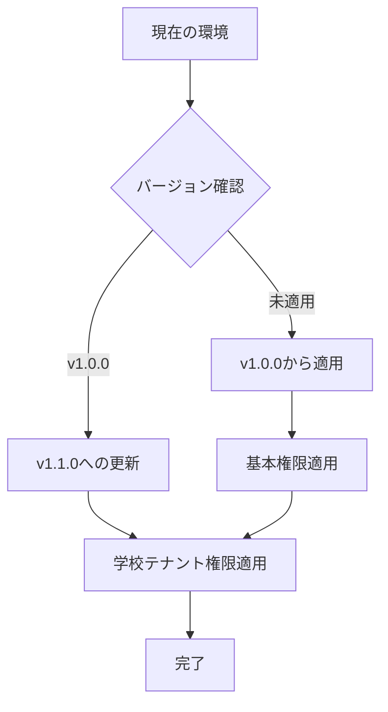

# 本番環境用権限・ロール管理ガイド

## 🎯 概要

学校テナント機能の権限・ロールを本番環境に安全に適用するためのガイドです。
開発環境での一括データ投入とは異なり、本番環境では既存データの保護と段階的適用が重要です。

## 📋 前提条件

### 必要な権限
- データベースへの読み書きアクセス
- Dockerコンテナの実行権限
- バックアップファイルの作成・保存権限

### 対象環境
- **STG環境**: テスト・検証用
- **本番環境**: プロダクション用

## 🔧 ツール構成

```
backend/
├── app/core/permissions.py           # 権限定義とマイグレーター
├── scripts/migrate_permissions.py    # Python CLI ツール
├── scripts/migrate_permissions_docker.sh  # Docker対応シェルスクリプト
└── scripts/rollback_permissions.py   # ロールバック用 (要実装)
```

## 🚀 使用方法

### 1. 環境チェック

まず、対象環境の状態を確認します：

```bash
# STG環境のチェック
./backend/scripts/migrate_permissions_docker.sh check --environment stg

# 本番環境のチェック
./backend/scripts/migrate_permissions_docker.sh check --environment prod
```

### 2. 現在の設定をバックアップ

**⚠️ 重要**: マイグレーション前に必ずバックアップを作成してください：

```bash
# STG環境のバックアップ
./backend/scripts/migrate_permissions_docker.sh backup --environment stg

# 本番環境のバックアップ
./backend/scripts/migrate_permissions_docker.sh backup --environment prod
```

### 3. ドライラン実行

実際の変更前に、ドライラン（シミュレーション）を実行します：

```bash
# 最新版へのドライラン
./backend/scripts/migrate_permissions_docker.sh dry-run --environment stg

# 特定バージョンへのドライラン
./backend/scripts/migrate_permissions_docker.sh dry-run --version v1.1.0 --environment prod --verbose
```

### 4. 実際のマイグレーション実行

ドライランで問題がなければ、実際のマイグレーションを実行します：

```bash
# STG環境への適用
./backend/scripts/migrate_permissions_docker.sh migrate --version v1.1.0 --environment stg

# 本番環境への適用（要確認）
./backend/scripts/migrate_permissions_docker.sh migrate --version v1.1.0 --environment prod
```

### 5. インタラクティブモード

対話的にマイグレーションを実行する場合：

```bash
./backend/scripts/migrate_permissions_docker.sh interactive --environment stg
```

## 📊 バージョン管理

### 権限バージョン一覧

| バージョン | 説明 | 追加される権限・ロール |
|-----------|------|----------------------|
| v1.0.0 | 初期権限 | 基本的なシステム権限 |
| v1.1.0 | 学校テナント機能 | 学校管理者ロール、先生・生徒管理権限 |

### 段階的適用



## 🔐 権限一覧

### 学校テナント機能 (v1.1.0)

#### 学校管理機能
- `school_manage_users`: 学校内のユーザーを管理する
- `school_view_all_students`: 学校内の全生徒情報を閲覧する
- `school_view_all_teachers`: 学校内の全先生情報を閲覧する
- `school_manage_settings`: 学校の設定を管理する
- `school_view_analytics`: 学校の統計・分析を閲覧する
- `school_manage_assignments`: 先生と生徒の担当関係を管理する
- `school_admin_access`: 学校管理機能へのアクセス

#### 先生・生徒管理機能
- `teacher_view_assigned_students`: 担当生徒の情報を閲覧する
- `teacher_view_student_chat`: 担当生徒のチャット履歴を閲覧する
- `teacher_view_student_statements`: 担当生徒の志望理由書を閲覧する
- `teacher_view_student_schools`: 担当生徒の志望校情報を閲覧する

### ロール構成

#### 学校管理者ロール
- 学校内の全ユーザー管理
- 学校統計・分析の閲覧
- 先生・生徒の担当関係管理
- 学校設定の変更

#### 教員ロール（拡張）
- 担当生徒の詳細情報閲覧
- チャット履歴・志望理由書の確認
- 志望校情報の参照

## ⚠️ 本番環境での注意事項

### 1. 実行タイミング

- **推奨時間帯**: メンテナンス時間またはアクセス数が少ない時間帯
- **避ける時間帯**: ピーク時間、定期テスト期間

### 2. 事前準備

```bash
# 1. 必要なバックアップ作成
./backend/scripts/migrate_permissions_docker.sh backup --environment prod

# 2. STG環境での事前テスト
./backend/scripts/migrate_permissions_docker.sh migrate --version v1.1.0 --environment stg

# 3. ドライラン実行
./backend/scripts/migrate_permissions_docker.sh dry-run --version v1.1.0 --environment prod
```

### 3. 実行後の確認

```bash
# 1. 環境チェック
./backend/scripts/migrate_permissions_docker.sh check --environment prod

# 2. アプリケーション動作確認
# - 管理者画面へのアクセス
# - 権限が必要な機能の動作確認
# - エラーログの確認

# 3. バックアップファイルの確認・保存
ls -la ./backups/
```

## 🔄 ロールバック手順

問題が発生した場合のロールバック：

```bash
# 1. バックアップファイル確認
ls ./backups/

# 2. ロールバック実行
./backend/scripts/migrate_permissions_docker.sh rollback \
  --backup-file permission_backup_YYYYMMDD_HHMMSS.json \
  --environment prod

# 3. 動作確認
./backend/scripts/migrate_permissions_docker.sh check --environment prod
```

## 📝 トラブルシューティング

### よくある問題と解決方法

#### 1. Dockerコンテナが起動していない

```bash
# エラー: バックエンドコンテナが実行されていません
# 解決: コンテナを起動
docker-compose -p react-ai-chatapp-prod up -d backend
```

#### 2. 権限がすでに存在する

```
権限 'school_admin_access' は既に存在します
```
これは正常な動作です。既存の権限はスキップされます。

#### 3. データベース接続エラー

```bash
# 接続設定確認
docker-compose -p react-ai-chatapp-prod exec backend env | grep DATABASE
```

### ログファイル

実行ログは以下に保存されます：

```
permission_migration.log       # 全般的なログ
migration_log_YYYYMMDD_HHMMSS.json  # マイグレーション結果
./backups/                     # バックアップファイル
```

## 🎯 ベストプラクティス

### 1. 段階的適用

1. **開発環境** → テスト → 動作確認
2. **STG環境** → 本格テスト → UI/UX確認
3. **本番環境** → 本番適用 → 監視

### 2. チェックリスト

- [ ] バックアップファイル作成完了
- [ ] STG環境での事前テスト完了
- [ ] ドライラン実行・結果確認完了
- [ ] メンテナンス時間帯での実行
- [ ] 実行後の動作確認完了
- [ ] バックアップファイル保存完了

### 3. 監視項目

- アプリケーションエラーログ
- データベースパフォーマンス
- ユーザーからの問い合わせ
- 権限関連エラーの発生有無

## 📞 サポート

問題が発生した場合：

1. **ログファイル確認**: `permission_migration.log`
2. **バックアップからのロールバック**
3. **開発チームへの連絡**

---

**⚠️ 注意**: 本番環境への適用は必ず事前テストを実施し、バックアップを作成してから実行してください。
